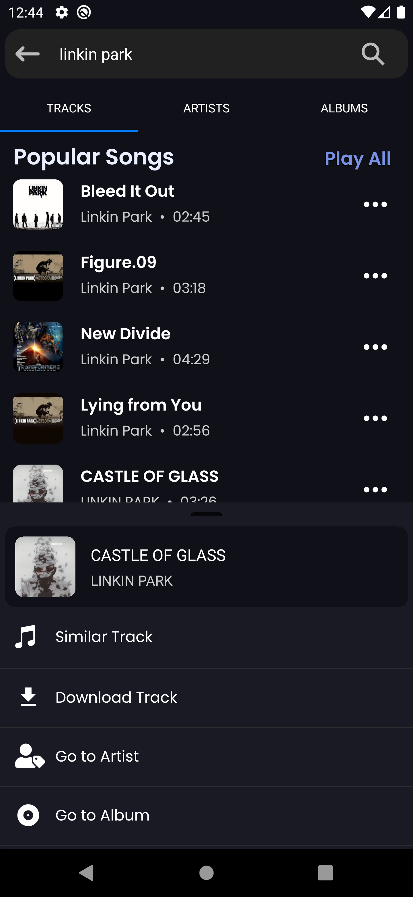

It's just an application I made to learn React Native, while I listening and download music and maybe there are errors that I have not contemplated.
Only for android I don't have iOS devices, f**k.

## Demo

Screenshots of the application working

  
  
  
  

  
  
  
  

## Features

- Listen to music
- Download track
- Search by artist, album or playlist
- Background listening

## Download APK

## Open Source and Disclaimer

This software is **open source** and is available under the [MIT License](LICENSE). You are free to use and modify this software in accordance with the terms of the license.

### Disclaimer

The author of this software is not responsible for any misuse or consequences resulting from improper use of the software. The software is provided "as is," without warranties of any kind, either express or implied, including, but not limited to, the implied warranties of merchantability, fitness for a particular purpose, and non-infringement. The use of this software is at your own risk and responsibility.

It is important that users comply with applicable laws and regulations when using this software.

