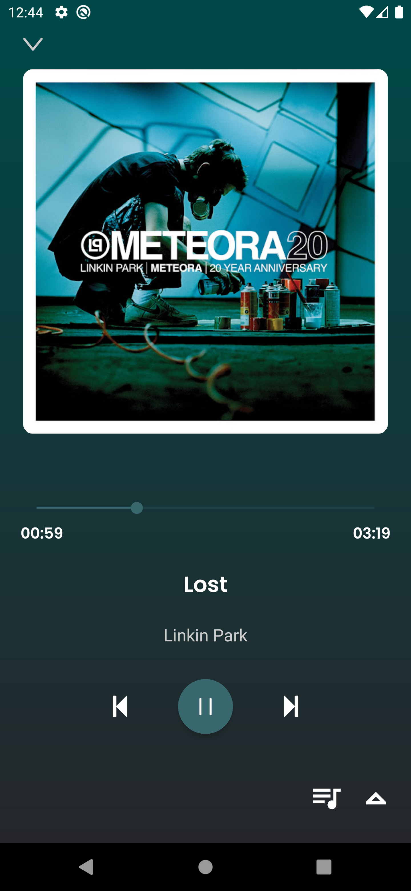

# HiBeat!


It's just an application I made to learn React Native, while listening and download music.

## Demo
Screenshots of the application working

<div align="center">
  
  
  
</div>

<div align="center">
  
  
  
</div>

<div align="center">
  
  
  
  
</div>


## Features

- Light/dark mode toggle
- Live previews
- Fullscreen mode
- Cross platform


## Installation

Install my-project with npm

```bash
  npm install my-project
  cd my-project
```
    
## Deployment

To deploy this project run

```bash
  npm run deploy
```


